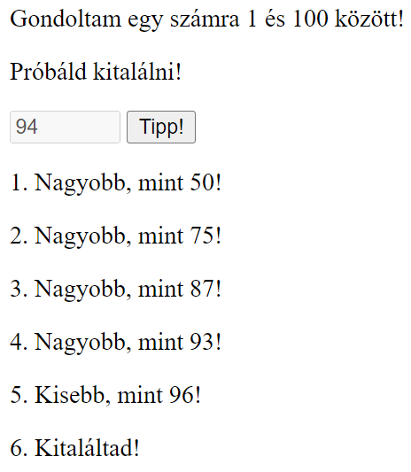

# 2. DOM, események

1. **Gondoltam.** Készíts egy számkitalálós játékot!

    a. Generálj 1 és 100 között egy számot véletlenszerűen!

    b. Tippeléskor (gomb kattintásra) jelezd a játékosnak, hogy az általa megadott számhoz képest kisebb vagy nagyobb a kitalálandó szám!

    c. A szám kitalálását követően a gomb ne működjön, a beviteli mező legyen inaktív!

    

    
    

