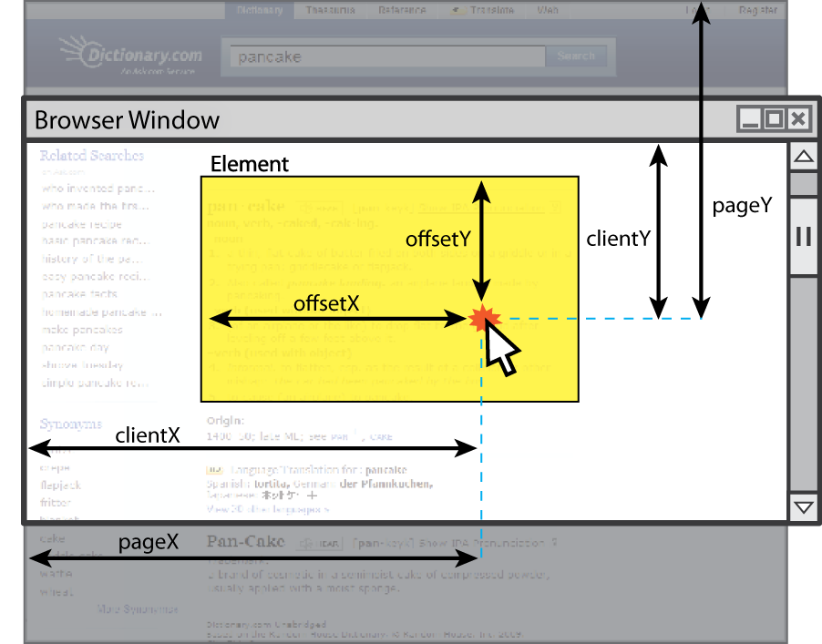

# 2. Események

1. **Rajzlap.**
   
    a. Készíts egy rajzoló alkalmazást `<svg>` segítségével, amelyet használva szakaszokat és köröket tudunk rajzolni!

    Két egymást követő kattintásra rajzoljunk ki egy szakaszt a megfelelő pontok között! `handleClick()`

    `nameSpaceURI`: http://www.w3.org/2000/svg

    Koordináta-rendszerek:
    `clientY`: böngésző (látható részének) tetejétől távolság
    `pageY`: oldal (totális) tetejétől távolság
    `screenY`: képernyő (monitor) tetejétől távolság
    `offsetY`: elem (e.target) tetejétől távolság

    <p align="center">
    
    </py>

    ```html
    <line x1="216" y1="195" x2="184" y2="229" stroke="black">
    ```

    Javasolt egy `createLine(p1, p2)` segédfüggvény használata!

    b. Az egér két kattintás közötti mozgatása esetén jelezzük, hogyan nézne ki a rajz aktuális állapota! `handleMove()`

    **Ötlet**: tegyük le a pontot az egér lenyomásakor, majd mozgatáskor módosítsunk az `<svg>` utolsó elemén.

    c. Két kattintás helyett oldjuk meg a feladatot az egérgomb nyomva tartásával! `mousedown`, `mouseup`

    d. A `ctrl` billentyű nyomva tartása esetén ne szakaszt rajzoljunk, hanem kört! `createCircle(p1, p2)`, `drawObject(x, y, isCircle)`

    ```html
    <circle cx="50" cy="50" r="50" fill="white" fill-opacity="0" />
    ```

    e. Kezeljük le azt a hibát, amikor az egeret a rajzterületen nyomjuk le, de azon kívül engedjük fel!

    **Ötlet**: mozgatáskor figyeljük, hogy elhagyjuk-e a vásznat valamelyik oldalról, és amennyiben igen, akkor váltsunk ki egy `mouseup` eseményt! `isMouseOut(x, y)`

    f. Kezeljük le azt a hibát, amikor az egeret a rajzterületen kívül nyomjuk le, majd azon belül engedjük fel!

    **Ötlet**: csak akkor hozzunk létre új elemet ha `mousedown` esemény váltódott ki (vizsgáljuk az esemény típusát)